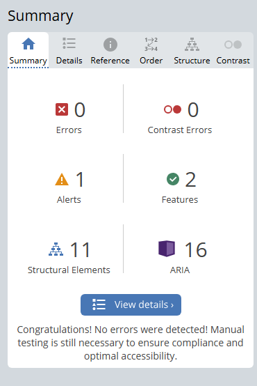

# FilmArchive

- Deployed Link - 

## Contents

- [FilmArchive](#FilmArchive)
    - [Contents](#Contents)
    - [Overview](#Overview)
- [User Experience](#User-Experience-(UX))
    - [User Stories](#User-Stories)
    - [Agile and MoSCoW Prioritization](#agile-and-moscow-prioritization)
    - [Entity Relationship Diagram](#entity-relationship-digram)
- [Design](#design)
    - [Wireframes](#wireframes)
    - [Colours](#colours)
    - [Colour Accessibility](#colour-accessibility)
    - [Font](#font)
- [Features](#features)
    - [Header / Navigation](#header--navigation)
    - [Footer](#footer)
    - [Home Page](#home-page)
    - [Reviews](#reviews)
    - [Review Detail](#review-detail)
    - [Add Reviews](#add-reviews)
    - [Sign Up](#sign-up)
    - [Profile](#profile)
- [Testing](#testing)
    - [HTML Validation](#html-validation)
    - [CSS Validation](#css-validation)
    - [Python Vaidation](#python-validation)
    - [JavaScript Validation](#javascript-validation)
    - [Lighthouse Test](#lighthouse-test)
    - [WAVE Accessibility Test](#wave-accessibility-test)
- [Deployment](#deployment)
- [Bugs](#bugs)
- [Future Features](#future-features)
- [Frameworks and Technologies](#frameworks-and-technologies)
- [Credits](#credits)

## Overview

FilmArchive is a full-stack website designed to create a community amongst film lovers and enthusiasts. The project is centered around the review and comment functionality which was the initial idea for the project. The reviews aspect of the project allows users to create a review on any film of their choosing and share it. Users are also able to comment on any reviews they find interesting as a way to interact with others. Each user has access to a profile which they are able to add an avatar and a bio. The profile is also a location where users are able to see the reviews they have made as well as their watch later section. By default reviews are saved to the users profile allowing them to easily be managed and acts as a way to track films that have been watched. Furthermore, films can be added to a watch later list if users see any films that peak their interest and want to remember them for the next time they are looking for a film to watch.

## User Experience (UX)

### User Stories

| User Story | Priority |
|----------------------------------------------------------------------------------------------------------------------------|---------------|
| As a **user**, I can view a home page so that I can see relevant information about the website and how it works. | **MUST HAVE** |
| As a **user**, I can create an account so that I can access additional features of the website. | **MUST HAVE** |
| As a **user**, I have access to an account page so that I can view my details, reviews I have made and my watched / want to watch lists. | **MUST HAVE** |
| As a **user**, I have access to a reviews page so that I can see a list of all recent reviews other users have submitted. | **MUST HAVE** |
| As a **user**, I can create a review so I can share my thoughts on a film and interact with the community. | **MUST HAVE** |
| As a **user**, I can edit reviews I have made so that I can update any information about the film / change the review itself. | **MUST HAVE** |
| As a **user**, I can comment on other users reviews as a way to interact with the rest of the community. | **MUST HAVE** |
| As a **Site Owner**, I can create, read, update and delete reviews from the website in order to manage the content that is shown. | **MUST HAVE** |
| As a **user**,  I can add films to my watch later list so that I can keep track of films I want to see. | **SHOULD HAVE** |
| As a **user**, I can delete films from my watch later list in case I no longer want to watch them or they were added by mistake. | **SHOULD HAVE** |
| As a **user**, films I have reviewed will be added to my watched/ reviewed list so that I can keep track of films I have already reviewed. | **COULD HAVE** |
| As a **user**, I can remove comments made on my own reviews so that there are no unnecessary or unwanted comments. | **WONT HAVE** |
| As a **user**, I can edit my comment on a review.  | **COULD HAVE** |

### Agile and MoSCoW Prioritization

Throughout the process of creating the project Agile planning methods were used. Using a GitHub project board I was able to map out the website features / user stories. In addition, the tasks were placed into one of three categories : Todo, In Progess and Done which allowed me track each task. This in turn gave me a good reference point for the overall progression of the project at different stages, which I found useful. MoSCoW Prioritization was used alongside this to split up tasks / user stories into either : Must Have, Should Have, Could Have or Won't have. This allowed for a clearer plan and to understand what tasks needed to be completed in order to achieve the MVP.

Project Board - [link](https://github.com/users/m-dixon5/projects/3)

### Entity Relationship Digram

Before starting the project an Entity Relationship Diagram was created in order to map out the database and to visualise how each table would interact with one another. I first created each table with all the neccessary key and field pairs using pen and paper. After I was happy that all fields and models were covered I moved on to determining the relationship each table had with another. To finalise everything I converted everything I had written down into Lucid Chart (see images below).

## Design

### Wireframes

From the start I tried to keep the project layout as simple as possible, putting more emphasis on creating an easier experience for the user. Figma was used to create the wireframes which allowed me to create a more detailed picture of what each page was going to look like compared to other design sites. Furthermore, due to the detail of the wireframes created the finished project managed to look very similar to the original designs / plans.

Mobile Wireframes

Tablet Wireframes

Desktop Wireframes

### Colours

Simililar to the layout and structure of the site I kept the number of colours I used for the project to a minimum. The logo was created initially and determined the colours I finally choose for the website. Shades of grey / black make up the majority of the palette and were used for different layers / feature backgrounds and a shade of white was used for the majority of the text. The final colour of red was used throughout the website to highlight or break up certain features.

### Colour Accessibility

All colour pairings were checked using Adobe Color Contrast Checker :

### Font

## Features

### Header / Navigation

Header Image

The navigation / header, like many other elements, has a minimal design. The background colour matches the rest of the main / body which allows the page to look cleaner and flow better. Each nav link also has css applied to it to indicate which element is currently hovered over by the user.

### Footer

Footer Image

The footer was also kept simple with a design similar to a earlier project. It includes social media icons that when clicked open in a new tab and have styles applied to indicate the user is hovering over them. The website does not have any social media accounts and the links instead take users to the signup / start pages. However, the github is linked to my own account.

### Home page

Home Page Image

The home page consists of a hero section, about section and four info cards. The hero section is kept concise and points out how signing up can give the user access to certain features. A sign up button is also included for new users and takes them straight to the registraton page. Info cards can also be found below the about section to give a quick overview about the features available to the user.

Info Cards Image

### Reviews

Reviews Page Image

All user reviews are displayed in the reviews section with each review given its own card. The cards display the film image, film title, user and a short summary of the user review that is limited to 100 characters. Each card acts as a link and opens up the full review page when clicked. Cards are also responsive at all screen sizes by using bootstrap rows and columns.

### Review Detail

Review Detail Image

After clicking on a review card from the reviews page each review opens up in more detail with the full review, rating and date watched being displayed. JavaScript was included which alters the background colour of the rating depending on how high the user scored the film. For films below 4 the background colour is red, between 4 and 6 orange, between 6 and 8 light green and above 8 a darker green. The comments section was placed below the review card and the add button is available for users who have a registered account.

### Add Reviews

Add Review Page Image

The Add review form utilises crispy forms and allows uses to input all the details on the film they want to review. A RichTextField was also used for the main review input to allow users to add additional styles and manipulate the layout. Cloudinary was used also to allow users to upload their film images and store them. Lastly, the review summary input uses django max and min validators meaning the user cannot enter a value that is outside the range of 0 to 10.

### Sign Up

Sign Up Page Image

The sign up page form follows the basic design of the majority of the input forms across the website. Django AllAuth  was used to provide user authentication and the basic templates. In addition, the form provides user feedback if email and password fields are inputted incorrectly . An image of this can be seen below.

Sign Up Error

### Profile 

Profile Page Image

The Profile page starts out as a blank canvas and allows the user to add an avatar and a bio through a modal that appears after the edit button is clicked. Reviews that have been made by the user can be seen in the dropdown menu and link to the detailed view. The watch later feature is also located in the profile with the user being able to add a film by clicking the button which takes them to a seperate page. Users can also see how many films have either been reviewed or added to the watch later section next to their respective titles.

## Testing

### HTML Validation

To validate my HTML files I used the validator provided by W3C and inputted the code via direct input. The code was copied from the page source instead of the workspace due to django template language being present on all pages.

Most pages returned no errors or warnings apart from one or two. A common error was a button being located inside an anchor tag which was found across two pages. All fixes were simple enough and didn't cause too much hassle.

HTML Validation Image

| HTML Source Code/Page | Errors | Warnings |
| ---- | ------ | -------- | 
| Home | 0 | 0 |
| Sign In | 0 | 0 |
| Sign Up | 0 | 0 |
| Profile | 0 | 0 |
| Edit Profile Modal | 0 | 0 |
| Reviews Page | 0 | 0 |
| Add Review | 0 | 0 |
| Review Detail | 0 | 0 |
| Edit Review | 0 | 0 |
| Delete Review | 0 | 0 |
| Delete Comment | 0 | 0 |
| Add to Watch Later | 0 | 0 |
| Edit Watch Later Item | 0 | 0 |
| Delete Watch Later Item | 0 | 0 |

### CSS Validation

To validate my css file I used W3C CSS Validator. Orginally there were 2 errors relating to an incorrect font-weight value and a style that could not be set to none. These were quick fixes and after running the code again all errors had cleared. However, there are still 4 warnings present that relate to styles applied to scroll bars.

CSS Validation Image

### Python Validation

Python validation was completed using [CI Python Linter](https://pep8ci.herokuapp.com/#) which presented a couple small issues across different files. These issues mainly being empty lines at the end and a couple lines running over the character limit. Throughout the project the python black module was used on the files to try and keep everything up to date.

| Feature | admin.py | forms.py | models.py | urls.py | views.py |
|---------|----------|----------|-----------|---------|----------|
| Home | na | na | na | no errors | no errors |
| Profiles  | no errors | no errors | no errors | no errors | no errors |
| Reviews | no errors | no errors | no erros | no errors | no errors |
| Project App | na | na| na | no errors | na |

### JavaScript Validation

The project only uses a small amount of javascript code and to test this I used jshint. There are a few warnings present but no major errors were pulled up.

JavaScript Validation Image

JavaScript Validation Image 2

### Lighthouse Test

Testing both the reviews and home page on desktop and mobile sizes the lighthouse scores for the project were all around pretty good. All the images used for the website are WEBP or were converted to WEBP using Convertio to get the highest scores possible. A few issues that cropped up were related to the hero section and the logo not being sized correctly.

Lighthouse Home Page - Desktop

Lighthouse Reviews Page - Desktop

Lighthouse Home Page - Mobile

Lighthouse Reviews Page - Mobile

### WAVE Accessibility Test

WAVE was also used to further test the websites accessibility :

WAVE Accessibility

### Manual Testing

| Feature                    | Tested?  | User Input Required | User Feedback Provided     | Pass/Fail | Fix |
|----------------------------|----------|---------------------|----------------------------|-----------|-----|
| Navbar Elements | Yes | Click | All elements link correctly to their respective page | Pass | - |
| Hero Sign Up Button | Yes | Click | A user who is not currently signed in is taken to the sign up page | Pass | - |
| Edit Review | Yes | Click | Only user matching review can see edit button and is taken to the correct page after clicking | Pass | - |
| Delete Review | Yes | Click | Only user matching review can see Delete button and is taken to the correct page after clicking | Pass | - |
| Confirm Review Changes | Yes | Click | User is taken back to the reviews page and shown a message to confirm the changes have been made | Pass | - |
| Confirm Review Deletion | Yes | Click |  User is taken back to the reviews page and shown a message to confirm that the review has been deleted | Pass | - |
| Add Comments modal | Yes | Click | Add button is visible for logged in users and when clicked opens the modal to add a comment | Pass | - |
| Add Comment | Yes | Click and text input | User is able to input their comment and after clicking add are taken back to the review and informed that their comment has been added | Pass | - |
| Delete Comment | Yes | Click | Delete icon is only visible to the user who made it and upon clicking are taken to the confirm delete page | Pass | - |
| Confirm Delete Comment | Yes | Click |  | Pass | - |
| Add Review | Yes | Image/Text/RichText/DateTime/Decimal fields | All required fields cannot be blank and provide feedback if left blank | Pass | - |
| Edit Profile Button | Yes | Click | On click the edit profile modal is opened | Pass | - |
| Edit Profile | Yes | Edit Image/RichText fields | Image is prepopulated so no input required and bio can also be left empty | Pass | - |
| Logout | Yes | Click | User is taken to home screen and shown a message to confirm they have been logged out . | Pass | - |
| Sign In | Yes | Email/Password/Text fields | All fields provide correct feed back if left blank or formatted incorrectly | Pass | - |
| Sign Up | Yes | Email/Password/Text fields |All fields provide correct feed back if left blank or formatted incorrectly. User will also be informed if passwords don't match. | Pass | - |
| Footer Icons | Yes | Click and hover | All icons take the user to the correct website in a new tab and change style to indicate they can be clicked.| Pass | - |

### Browser Compatibility

The website was tested across four different web browsers which were : Firefox, Edge , Safari and Chrome. All features were tested on each browser with no issues to styles or formatting.

### Responsivity

Real world testing was completed on :

- iPhone 11 Pro Max
- Google Pixel 7
- iPad Pro

Across all devices there were no issues present with responsivity or how the website was displayed.

Dev tools were also used throughout the whole process of building the website and to check for responsivity I mainly refered to these devices :

- iPhone 12 Pro
- iPad Pro 
- Nest Hub

### User Story Tests

| User Story                 | Acceptance Criteria Met?  | Tested | Response     | Pass/Fail | Fix     |
|----------------------------|---------------------------|--------|--------------|-----------|---------|
| #1 - Home page             | Yes                       | Yes    | No issues    | Pass      |    -    |
| #2 - Reviews Rage          | Yes                       | Yes    | No issues    | Pass      |    -    |
| #3 - Create a review       | Yes                       | Yes    | No issues    | Pass      |    -    |
| #4 - Edit Review           | Yes                       | Yes    | No issues    | Pass      |    -    |
| #5 - Register an Account   | Yes                       | Yes    | No issues    | Pass      |    -    |
| #6 - Add Film To Reviewed List | Yes                       | Yes    | No issues    | Pass      |    -    |
| #7 - Account Page          | Yes                       | Yes    | No issues    | Pass      |    -    |
| #8 - Manage Reviews        | Yes                       | Yes    | No issues    | Pass      |    -    |
| #9 - Add Comments to Review | Yes                       | Yes    | No issues    | Pass      |    -    |

## Deployment

The steps for deploying the project with Heroku are as follows : 

- Sign up / in to Heroku and head to the dashboard section.

- Locate the new button towards the top right and 'Create New App'.

- Select the region closest to your location and fill in the project name.

- Once you have created the app navigate to the settings tab to find config vars. Click on the area to reveal them and input the necessary key-value pairs.

- The key-pair values you will need are your : CLOUDINARY_URL, SECRET_KEY, DATABASE_URL, DISABLE_COLLECTSTATIC (Removed when project static files are created) and PORT:8000 (for running the server from your workspace).

- Make sure the Heroku app name is added to ALLOWED_HOSTS in settings.py.

- Ensure DEBUG is set to false and the requirements.txt folder is up to date using "pip3 freeze --local > requirements.txt".

- Commit any changes to GitHub before continuing.

- Head back to Heroku and find the deploy tab.

- Select GitHub as the deployment method, link your account and search for the repository you would like to connect.

- After everything is connected and the app is built you can head to manually deploy and click "Deploy branch".

- The view button will appear after everything has loaded which will allow you to see the deployed project. Any errors will be shown as soon as the program catches them and they can be viewed in the console.

## Bugs

| Bug | Solved | Fix | 
| ---------------- | ---- | ------------- |
| Error when saving profiles model due to conflicts between migrations| yes | Reverted profiles app migrations back to zero and ran migrations again |
| Success messages not rendering after submitting a form | yes | Moving the message.success above the return line in the function |

## Future Features

- Adding a film API that allows users to search for any film on an external database. This in turn would make it much quicker for users to review a film or add one to watch later as they are not required to input the information themselves. 

- Implementing a refine search to the reviews section that would allow users to search for reviews based on different criteria and tags associated with reviews.

- Ability to search or view other users profiles to see their reviews or watch later lists.

- Add a review count on each review / post so users are able to see how many times their post has been viewed. This could also link well with the refine search where users can filter by most popular reviews.

- Be able to create a thread in the comments section of each review to further enchance interactivity between users. This would allow multiple discussions to take place under any one post / review.

## Languages

- HTML

- CSS

- JavaScript

- Python

## Technologies

- [Figma](https://www.figma.com/) for wireframe creation.

- [Lucid Chart](https://www.lucidchart.com/pages/) to create Entity Relationship Diagram.

- [Cloudinary](https://cloudinary.com/home) to store any images uploaded to the website.

- [Heroku](https://www.heroku.com/) for project deployment.

- [Coolors](https://coolors.co/) to create the website colour palette.

- [Logo.com](https://logo.com/) used to generate logo ideas for the website.

- [GitHub](https://github.com/) for version control and storage of the project.

- [Adobe Color](https://color.adobe.com/create/color-contrast-analyzer) to check for any contrast errors between colours.

- [Convertio](https://convertio.co/) to convert image format to WEBP.

- [Fontawesome](https://fontawesome.com/) for all icons used throughout the project.

- [ChatGPT](https://openai.com/index/chatgpt/) to create content for the reviews

- [Perplexity](https://www.perplexity.ai/) for help with code formatting and a small amount of javascript

## Credits

- [amylour](https://github.com/amylour) and [FreeFido_v2](https://github.com/amylour/FreeFido_v2) for guidance throughout the project and inspiration on the README layout (especially the testing section)

- [Dee Mc](https://www.youtube.com/@IonaFrisbee) for the django walkthrough which expanded my knowledge on how to use the django framework.

- [W3schools](https://www.w3schools.com/howto/howto_js_collapsible.asp) - collapse sections 

- [W3schools](https://www.w3schools.com/howto/howto_css_modals.asp) - edit modal for profile

- [geeksforgeeks](https://www.geeksforgeeks.org/limit-the-maximum-value-of-a-numeric-field-in-a-django-model/ ) - help with min and max fields.

- [Bootstrap Documentation](https://getbootstrap.com/docs/5.3/getting-started/introduction/)